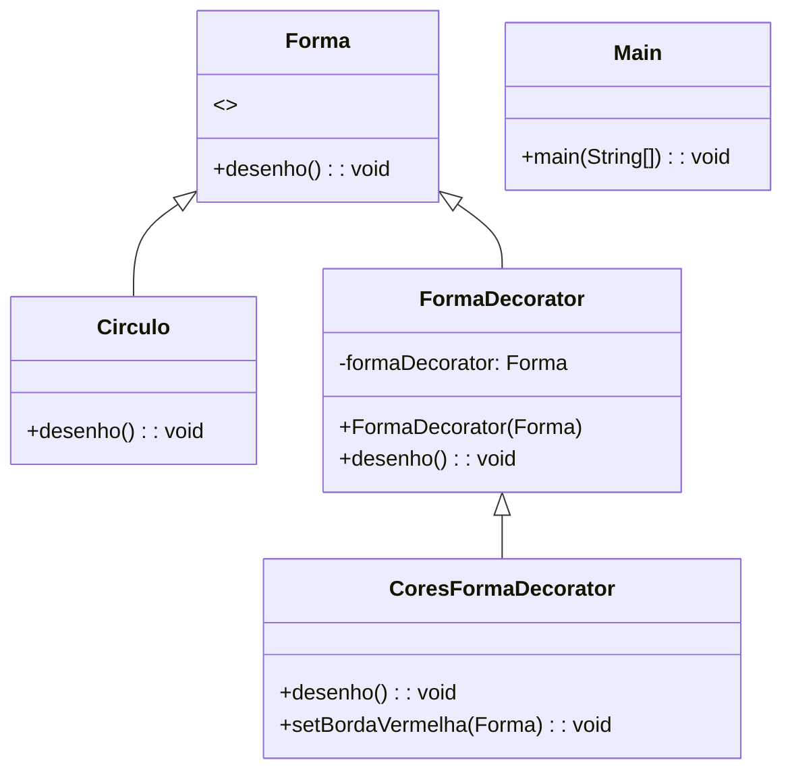

# Exemplo Design Patterns

## Autores
- [Alexandre Ladeira Silva](https://github.com/Ladeiraalexandre)

## Decorator

### Projeto simples apresentando o padrão de projeto estrutural Decorator

O padrão Decorator é um padrão de design estrutural que permite adicionar funcionalidades a um objeto dinamicamente. Este padrão envolve uma interface comum, um componente concreto, e um ou mais decoradores que implementam a mesma interface, adicionando funcionalidades ao componente concreto.

#### Exemplo
Foi criado um exemplo simples onde temos uma interface **Forma**, uma implementação concreta **Circulo**, e decoradores que adicionam funcionalidades adicionais, como cor e borda.

#### Explicação
- **Forma**: Interface comum para todos os tipos de formas.
- **Circulo**: Implementação concreta da interface **Forma**.
- **FormaDecorator**: Classe abstrata que implementa a interface **Forma** e contém uma referência a um objeto **Forma**. Esta classe é usada como base para todos os decoradores concretos.
- **CoresFormaDecorator**: Decorador concreto que estende **FormaDecorator** e adiciona funcionalidades adicionais (no caso, adiciona uma borda vermelha).

### Exemplo de Diagrama UML (utilizando a ferramenta Mermaid)

### Resumo

Neste exemplo, mostramos como usar o padrão Decorator para adicionar funcionalidades a um objeto **Forma** (neste caso, **Circulo**) dinamicamente. Criamos uma interface **Forma**, uma implementação concreta **Circulo**, um decorador abstrato **FormaDecorator**, e um decorador concreto **CoresFormaDecorator** que adiciona uma borda vermelha ao círculo. A classe principal demonstra como usar esses componentes juntos para criar e decorar formas.