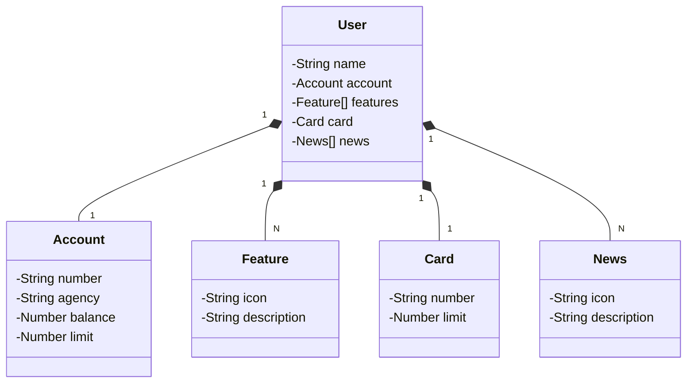

# BootCamp Santander 2024

Java RESTful API de uma Aplicação Bancária - criada para o Desafio do BootCamp Santander Back-End 2024.

## Principais Tecnologias
 - **Java 17**: versão Java mais estável no momento;
 - **Spring Boot 3**: Versão do Spring Boot, para maximizar a produtividade e autoconfiguração;
 - **Spring Data JPA**: Ferramenta para simplificar a camada de acesso aos dados, facilitando a integração com bancos de dados SQL;
 - **OpenAPI (Swagger)**: Para criar uma documentação de API eficaz e fácil de entender usando a OpenAPI (Swagger);
 - **Railway**: facilita o deploy e monitoramento de nossas soluções na nuvem, além de oferecer diversos bancos de dados como serviço e pipelines de CI/CD.

O Figma foi utilizado para a abstração do domínio desta API, sendo útil na análise e projeto da solução.

**Aplicação Bancaria**

## Diagrama de Classes (Domínio da API)

## IMPORTANTE

Este projeto foi construído com o objetivo de fixar os conhecimentos adquiridos durante o bootcamp e tem um viés totalmente voltado para estudos
