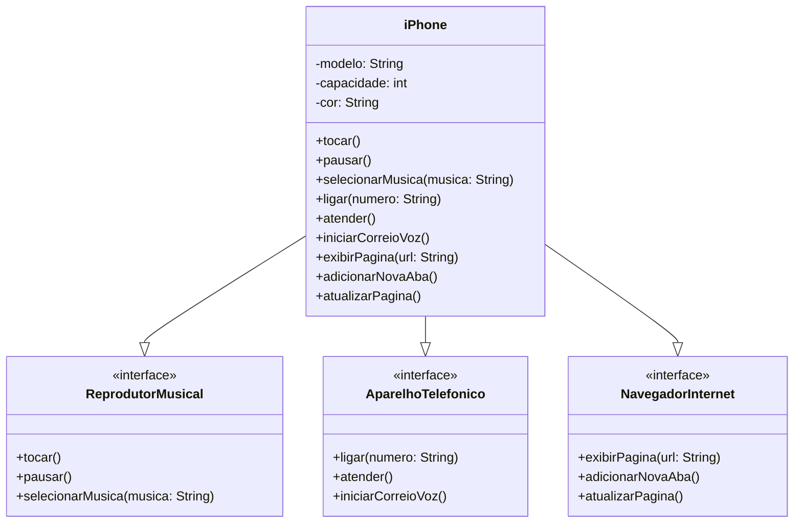

# [DIO](www.dio.me) - Trilha Java Básico

## Autores
- [Alexandre Ladeira Silva](https://github.com/Ladeiraalexandre)

## POO - Desafio

### Modelagem e Diagramação de um Componente iPhone

Diagrama UML do componente iPhone, abrangendo algumas funcionalidades como Reprodutor Musical, Aparelho Telefônico e Navegador na Internet.

#### Contexto
Com base no vídeo de lançamento do iPhone de 2007 (link abaixo), foi realizado a diagramação das classes e interfaces para representar algumas funcionalidades e também um exemplo de implementação com a linguagem Java.

[Lançamento iPhone 2007](https://www.youtube.com/watch?v=9ou608QQRq8)

- Minutos relevantes: 00:15 até 00:55

#### Funcionalidades Modeladas
1. **Reprodutor Musical**
   - Métodos: `tocar()`, `pausar()`, `selecionarMusica(String musica)`
2. **Aparelho Telefônico**
   - Métodos: `ligar(String numero)`, `atender()`, `iniciarCorreioVoz()`
3. **Navegador na Internet**
   - Métodos: `exibirPagina(String url)`, `adicionarNovaAba()`, `atualizarPagina()`

### Exemplo de Diagrama UML (utilizando a ferramenta Mermaid)

[Exemplo implementação](https://github.com/Ladeiraalexandre/dio-trilha-java-basico/tree/master/DesafioPOO/DesafioPOO/src/com/desafiopoo/model)